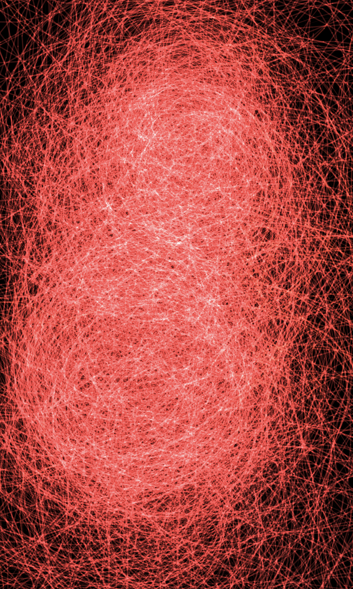

## Generative Art

An experimental visualization exploring techno-ecological systems with flowing, organic patterns.

Key Features:

HSB color mode focusing on red/infrared spectrum
Perlin noise-driven branch growth and movement
Additive blending for luminous, glowing effects
Interactive elements responding to mouse position
Slow temporal evolution creating a "cosmic timescale" feel
Technical Highlights:

Branch generation system with multiple generations
Energy field influenced by mouse interaction
Real-time noise-based animation
Minimalist, reduced grid density for organic flow
Controls:

SPACE - Pause/resume animation
R - Regenerate branches
Mouse position influences branch behavior and energy level
Color Palette:

Deep infrared (dark red)
Mid infrared
Near infrared
Visible red edge

# Video / Screenshots

<video controls src="AbstractLines.mp4" title="Generative Art Animation"></video>

