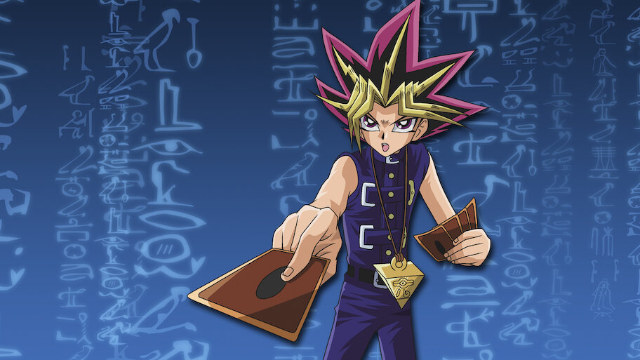
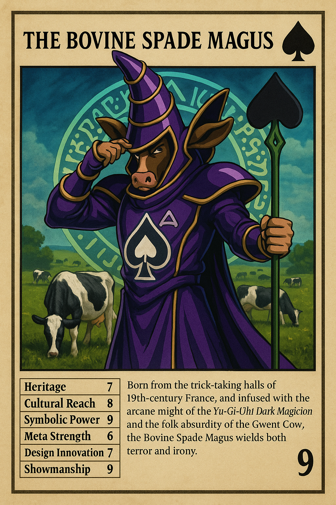

# Vincent PALEY

## Research
I am researching how duel playing cards — from their medieval origins to today’s trading card games — carry layers of cultural symbolism, mechanics, and visual identities, and how fusing them can reveal hidden narratives about history, play, and imagination.

- Insight 1 : 

First inspiration, from the old memory of the gesture of invoke a card that will battle for you in Yu Gi OH

- Insight 2 : 

second inspiration of invoking a card charcater via a digital interface in yu gi oh

- Insight 3 :

A massive gap between the complexity of more recent duel card game and very old ones. -> War versus Magic the Gathering

- Insight 4 : 

Videos, representation of duelling both in virtual and real word

https://www.youtube.com/watch?v=J5vT33Vo04s

https://www.youtube.com/watch?v=PMG7zw8eI8E

https://www.youtube.com/watch?v=XnF_xXT-VKE

https://www.youtube.com/watch?v=kbWDFkSgKwI

https://www.youtube.com/watch?v=I9J8XrRGk78

- Insight 5 : 

Example of an hybridization of old cards with one more recent one. Giving a first glimpse of what could be created by visitors. They are from a data base I have created of 3 cards for each 28 duel games I have found throughout the years of duelling card game. For each card there is statistics based on their history and a summary of the origin of the card.

Also two other ones, but less connected to old cards :

## Work Title
Cauldron of Eras

## Keyword
hybridization / chimère / mutation / amalgame / morphing

## User Journey

1. Selection / Agency

The visitor chooses 2-4 cards from different sets (e.g., a queen from piquet, a Pokémon, and a gothic fantasy necromancer).

2. Fusion / Creation

They place the cards into a scanner or digital interface → the system generates a hybrid card (visual + text + stats). The hybrid includes playful rules, but also short cultural insights (e.g., “The Ace of Spades was once seen as a symbol of fate and death…”).

3. Discovery / Reflection

The visitor sees the new hybrid card printed on a screen or projected on the wall, or/and printed as a takeaway. They learn about the cultural history of each component and how their choices blended.

4. Sharing / Legacy

The new card is saved into a collective “living deck” of the exhibition. Visitors can browse other hybrids, creating a growing shared archive of imagined cards — a hybrid mythology shaped by everyone.

## Novel Combinations
deck building with AI, physical object created from the generation, creating the feeling of invoking a card from a digital interface to the real world (ideally it would be a 3D model of your hybrid character/card, but might be too expensive)

card, merge and deck / hybridization / chimère / fishing / mutation / amalgame / morphing